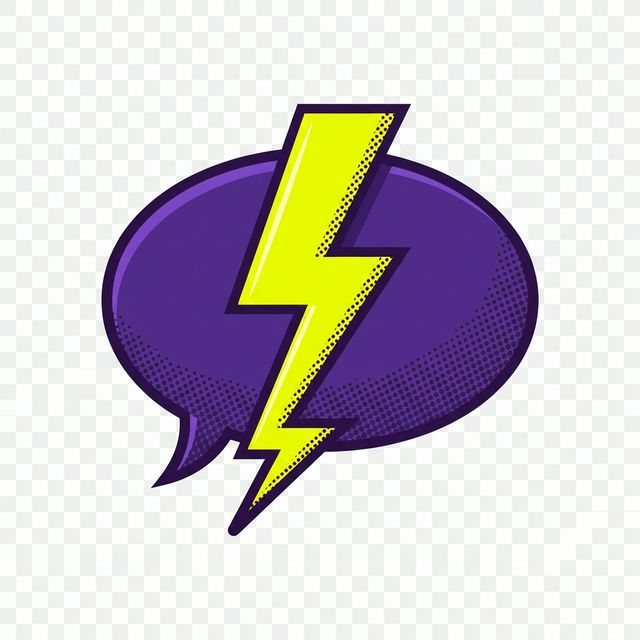
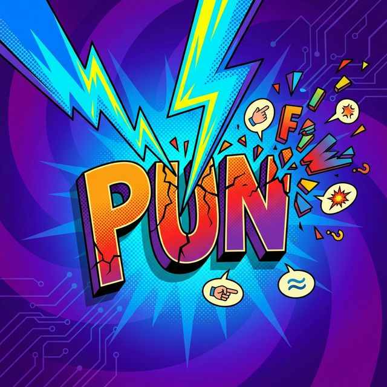

<p align="center">
  
</p>

<h1 align="center">Punderstruck</h1>

<p align="center">
  <em>Because your AI deserves better material.</em>
</p>

<p align="center">
  
</p>

---

## What Is This?

Most AI pun generators pull from a stale database of jokes your uncle already forwarded in 2019. Punderstruck takes a completely different approach.

It's an agent skill that *discovers* puns in real time using the [Datamuse API](https://www.datamuse.com/api/) for phonetic analysis, combined with structured comedy construction methodology. Every pun gets built from scratch, scored against five quality criteria, and delivered only if it clears a 17/25 bar.

The skill works with any AI coding agent or assistant that supports custom skills, including Claude Code, Windsurf, Cursor, Claude Desktop, and others. If your agent can load a SKILL.md file and run tool calls, Punderstruck will work.

## How It Works (The Short Version)

You give it a topic. The skill extracts "handles" (the words that matter), queries Datamuse for sound-alikes and homophones, analyzes the collision space for cognitive distance, constructs punchlines using comedy theory, scores them ruthlessly, and serves only the survivors.

All of that happens behind the scenes. You get the pun, and none of the pipeline noise.

## Modes

Punderstruck ships with a bunch of ways to get creative:

| Command | What Happens |
|---------|-------------|
| `/punderstruck` | Random pun, full pipeline, no topic constraint |
| `/punderstruck [topic]` | Focused puns on your topic |
| `/punderstruck --roast [topic]` | Pun-based roasts with adjustable heat level |
| `/punderstruck --translate "[phrase]"` | Turns corporate jargon into wordplay |
| `/punderstruck --remix` | Famous quotes and lyrics, rebuilt as puns |
| `/punderstruck --compose [format] about [topic]` | Longer-form compositions (limericks, haiku, sonnets, you name it) |
| `/punderstruck --explain` | Delivers the pun, then dissects the comedy mechanics |
| `brainstorm puns for...` | Collaborative pun consulting for your projects |
| `shower thought about [topic]` | Those 2am "wait, actually..." observations |
| `wordplay on [word]` | Manipulates the word itself, phonetically and structurally |

Flags combine freely. Go wild.

## Sample Output

**Standard mode** (`/punderstruck AI`):

> I asked my AI to lose some parameters, but it told me to weight.

**Compose mode** (`/punderstruck --compose limerick about sales`):

> A sales rep obsessed with her funnel,
> Tried closing through some kind of tunnel.
> She said with a grin,
> "I'm piping them in!"
> Now her pipeline's become departmental.

**Roast mode** (`/punderstruck --roast marketers`, Medium Roast ☕☕):

> You talk about "driving engagement" like you're behind the wheel, but the only thing you've ever driven is a rebrand into a ditch. Your funnel has more leaks than your strategy has layers, and honestly, the best conversion you've ever pulled off is convincing finance to approve another tool.

**Shower thought** (`shower thought about meetings`):

> Every meeting could've been an email, but every email could've been a meeting that never happened.

## Roast Mode

Roast mode deserves its own section because it's where Punderstruck truly shows its range. When you trigger `--roast`, the skill asks you to pick a roast level before it starts cooking:

| Level | Label | What You Get |
|-------|-------|-------------|
| 1 | **Light Roast** ☕ | Playful wordplay, barely a tease. Grandma-safe. |
| 2 | **Medium Roast** ☕☕ | Pointed puns with a knowing wink. Coworkers gasp-laugh. |
| 3 | **Dark Roast** ☕☕☕ | Sharp and unapologetic. HR might overhear. |
| 4 | **Espresso Shot** ☕☕☕☕ | One devastating concentrated line. Maximum damage per word. |

Every roast (except Espresso) follows a comedy monologue arc: an opener that addresses the target directly, a build where each line escalates with puns from the pipeline, a callback that references earlier material, and a mic drop closer that lands the hardest punch.

Espresso is different. One line. 10-20 words. Maximum devastation per syllable. No buildup, no arc, just the shot.

The target can be a profession, a concept, an industry, or anything you throw at it. Every roast runs through the full quality pipeline, and the skill always roasts the *archetype*, never individuals. The target should laugh the hardest.

## The Personality

Punderstruck takes the *craft* seriously while never taking itself too seriously. The vibe is sassy, warm, confident, and a little unhinged, like the funniest person at the dinner party who also happens to have studied comedy theory. When a pun stretches, the skill owns that stretch with confidence rather than apology.

## Quality Control

Every pun runs through a five-criteria scoring system:

1. **Effortless Activation**: Does the double meaning land instantly?
2. **Surprising Punchline**: Did you see it coming? (You shouldn't have.)
3. **Groan-Worthy**: The good kind of groan. The involuntary one.
4. **Setup Brevity**: Short setups hit harder. Target: 8-20 words.
5. **Actually Funny**: Score below 3/5 and the pun is eliminated, with no exceptions. This criterion has veto power.

Minimum to serve: **17/25**. If nothing passes, the skill digs deeper rather than serving mediocre material.

## Compatibility

Punderstruck works with any agent or AI assistant that supports custom skills with tool/file access:

- **Claude Code**
- **Windsurf** 
- **Cursor** 
- **Claude Desktop** 
- **Antigravity** and other skill-compatible agents

The only actual requirements are internet access (for Datamuse API calls) and a willingness to groan.

## Installation

Download or clone this repo, then add it as a skill in your agent of choice. The `SKILL.md` file contains the full instruction set, and the `references/` folder holds the comedy theory, pipeline details, and taxonomy that power the whole thing.

For most agents, that means pointing your skill/project configuration at the folder containing `SKILL.md`.

## Project Structure

```
punderstruck/
├── SKILL.md                          # The main skill prompt
├── README.md                         # You are here
├── LICENSE                           # Proprietary, personal use only
├── assets/
│   ├── punderstruck-hero.png         # Hero image
│   └── punderstruck-logo.png         # Logo
└── references/
    ├── pipeline-detailed.md          # Full pun construction pipeline
    ├── bonus-modes.md                # Roast, translate, remix, compose specs
    ├── comedy-theory.md              # Joe Toplyn method + theory foundations
    ├── pun-taxonomy.md               # Classification of pun mechanisms
    └── worked-examples.md            # Scored examples for calibration
```

## Built By

**Alex Greenshpun** is an AI Strategist, former VP of Marketing, and a person whose love of puns has been described by colleagues as "a condition." She believes AI should amplify human creativity rather than replace it, and she also believes every product name is a pun waiting to happen. When she's not building AI-augmented marketing systems at [10x Company](https://the10xcompany.ai), she's teaching agents how to be funnier, because apparently 15 years of B2B marketing wasn't punishment enough.

- [LinkedIn](https://linkedin.com/in/alexgreensh)
- [10x Company](https://the10xcompany.ai)

## License

Proprietary, personal use only. See [LICENSE](LICENSE) for details.

---

<p align="center">
  <em>Made with equal parts comedy theory and questionable life choices.</em>
</p>
